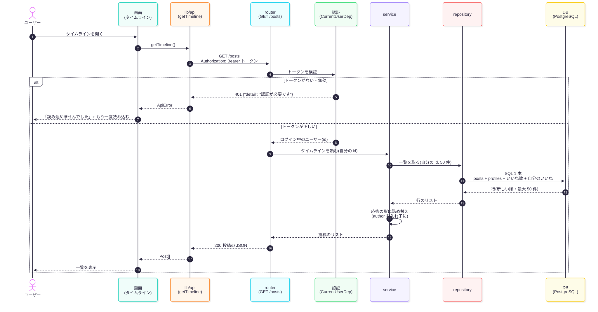
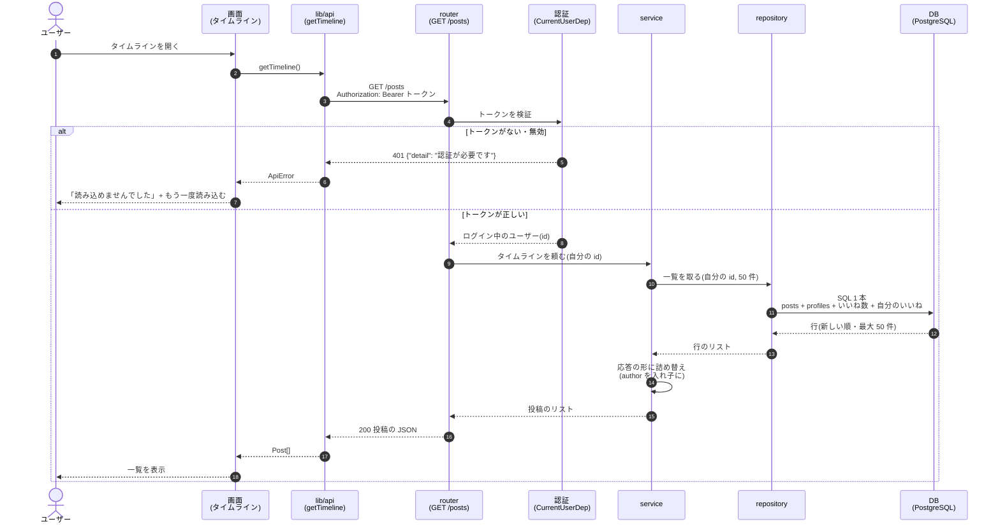

# API 仕様:5.4 投稿一覧の表示

## 1. 概要

| 項目     | 内容                                                        |
| -------- | ----------------------------------------------------------- |
| WBS      | 5.4                                                         |
| API      | `GET /posts`                                                |
| 内容     | タイムラインの投稿を、新しい順に最大 50 件返す               |
| 認証     | 必須(`Authorization: Bearer <トークン>`)                  |
| 画面     | [02 タイムライン](../画面設計/02_タイムライン/画面仕様.md) |
| 画面接続 | `apps/web/lib/api/posts.ts` の `getTimeline`                |

- 各投稿に、投稿者の名前・アイコン、いいね数、ログイン中のユーザーがいいね済みかを付けて返す
- ページングは 2次開発。それまでは最大 50 件

## 2. SQL

```sql
select
    p.id,
    p.content,
    p.image_url,
    p.created_at,
    pr.id           as author_id,
    pr.display_name as author_display_name,
    pr.avatar_url   as author_avatar_url,
    (select count(*) from likes l where l.post_id = p.id) as like_count,
    exists (
        select 1 from likes l where l.post_id = p.id and l.user_id = :user_id
    ) as liked_by_me
from posts p
join profiles pr on pr.id = p.user_id
order by p.created_at desc, p.id desc
limit :limit
```

| バインド変数 | 値                                     |
| ------------ | -------------------------------------- |
| `:user_id`   | ログイン中のユーザーの id(トークンの `sub`) |
| `:limit`     | 50                                     |

| 部分                         | 意味                                                                 |
| ---------------------------- | -------------------------------------------------------------------- |
| `join profiles pr on …`      | 投稿者の名前・アイコンは `profiles` にあるので、投稿した人(`user_id`)でつなぐ |
| `as author_id` など          | `posts` にも `id` があるので、投稿者の列には `author_` を付けて区別する |
| `(select count(*) …)`        | 投稿ごとに、その投稿の `likes` を数える(サブクエリ)                |
| `exists (… :user_id)`        | 投稿ごとに、自分のいいねがあれば true                                |
| `order by …, p.id desc`      | 同じ時刻の投稿があっても、毎回同じ順になるように `id` も並び順に入れる |

- 1 本の SQL で全部取る。投稿ごとに SQL を発行すると、50 件で 100 回以上になって遅くなる(N+1 問題)
- 値は必ずバインド変数(`:user_id` など)で渡す(SQL インジェクション対策)
- 開発用 DB で実行できることを確認済み

## 3. リクエスト

```yaml
GET /posts
headers:
  Authorization: Bearer <Supabase の JWT>
query: なし
body: なし
```

## 4. レスポンス

```yaml
"200":
  content:
    application/json:
      schema: list[PostResponse]
      example:
        - id: 12
          content: 今日のランチ
          image_url: null
          created_at: "2026-10-03T03:15:00+00:00"
          author:
            id: c01057d5-1269-47c0-8d7c-87da6c571c77
            display_name: makino_test
            avatar_url: null
          like_count: 2
          liked_by_me: true
```

| 項目                  | 型             | 説明                                     |
| --------------------- | -------------- | ---------------------------------------- |
| `id`                  | int            | 投稿 id                                  |
| `content`             | str            | 本文                                     |
| `image_url`           | str \| null    | 画像の URL(なければ null)              |
| `created_at`          | datetime(UTC) | 投稿日時                                 |
| `author.id`           | UUID           | 投稿者の id                              |
| `author.display_name` | str            | 投稿者の表示名(`profiles`)             |
| `author.avatar_url`   | str \| null    | 投稿者のアイコン(`profiles`)           |
| `like_count`          | int            | いいね数(全員分)                       |
| `liked_by_me`         | bool           | ログイン中のユーザーがいいね済みか       |

- 項目名は画面側の型 `Post`(`apps/web/lib/api/types.ts`)と同じ
- 並び順:`created_at` の新しい順。同じ時刻なら `id` の大きい順(毎回同じ順になるように)
- 投稿が 0 件なら `[]`(エラーにしない)

## 5. エラー処理

| ステータス | いつ                                 | `detail`                     |
| ---------- | ------------------------------------ | ---------------------------- |
| 401        | トークンがない                       | `認証が必要です`             |
| 401        | トークンが無効(期限切れ・改ざんなど) | `トークンが無効です`         |
| 503        | Supabase の公開鍵を取得できない       | `認証サーバーに接続できません` |
| 500        | DB に接続できないなど、予期しないエラー | (FastAPI の標準)           |

- 401・503 は 4.2 の認証(`CurrentUserDep`)がそのまま返す。この API で新しく作るエラーはない
- 画面側は、エラーのとき「タイムラインを読み込めませんでした」と「もう一度読み込む」を出す(`ApiError`)

## 6. シーケンス図



<details>
<summary>図の元(Mermaid)</summary>



</details>
