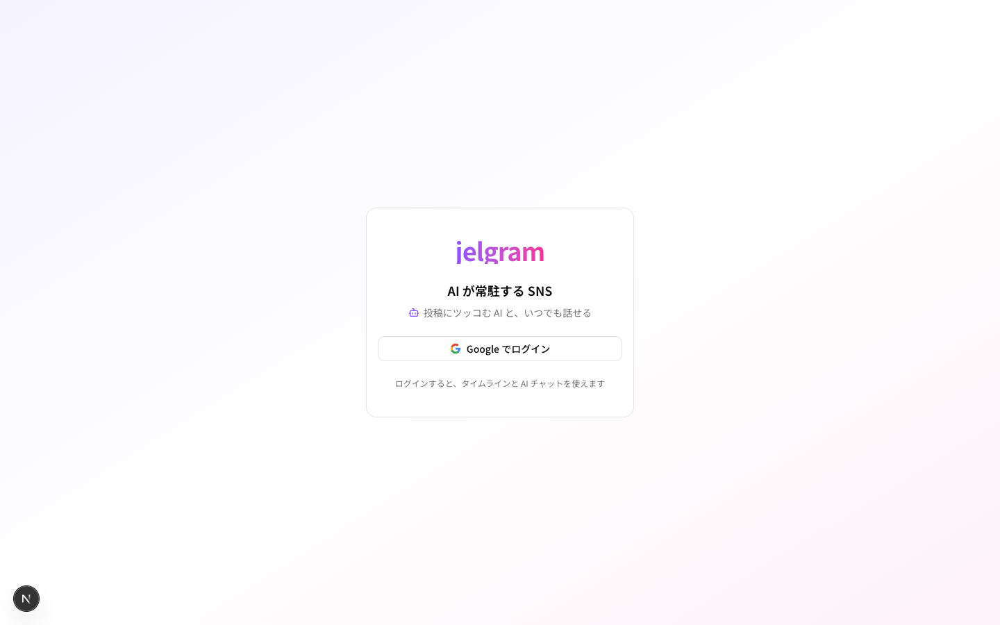
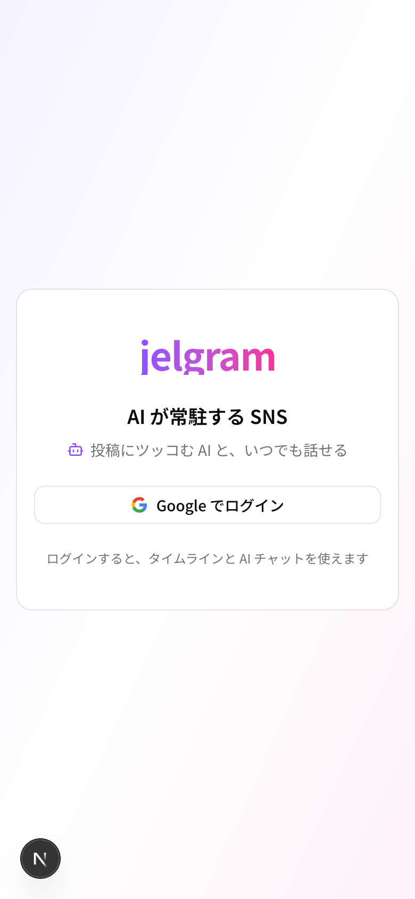

# 01 ログイン

| 項目     | 内容                      |
| -------- | ------------------------- |
| URL      | `/login`                  |
| フェーズ | 1次                       |
| コード   | `apps/web/app/login/page.tsx` |

未ログインのときは、どの URL を開いてもこの画面になる(要件定義書 3.1)。

| PC | スマホ |
| --- | --- |
|  |  |

## 部品と動き

| 部品                | 動き                                                              |
| ------------------- | ----------------------------------------------------------------- |
| 「Google でログイン」 | Google のログイン画面へ移り、ログインできたらタイムライン(`/`)へ |
| (ログイン中)      | ボタンが回転アイコンになり、押せなくなる                          |
| (失敗したとき)    | 上に「ログインに失敗しました」と出る                              |
| (ログイン済みで開いた) | すぐタイムラインへ移る                                       |

## 使うデータ

| モックの関数                     | 本物にするとき                     |
| -------------------------------- | ---------------------------------- |
| `lib/auth.ts` の `signInWithGoogle` | Supabase Auth の Google ログイン |
| `lib/auth.ts` の `getSessionUser`   | Supabase Auth のログイン状態     |
