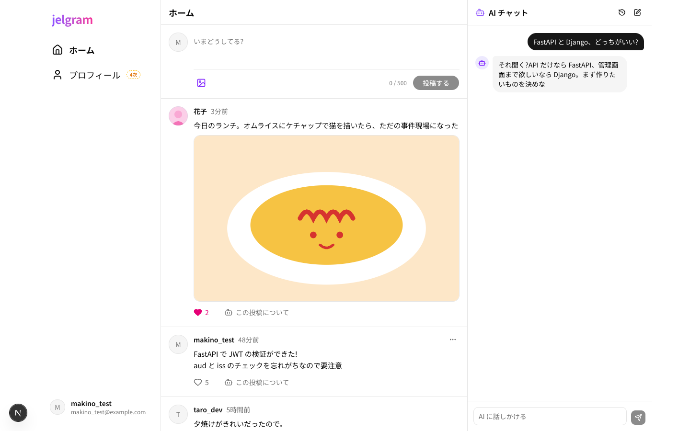
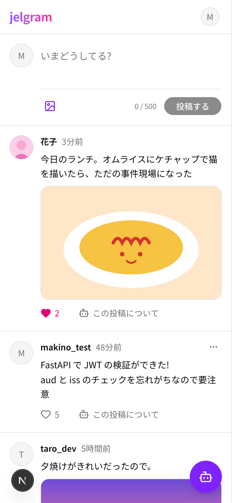
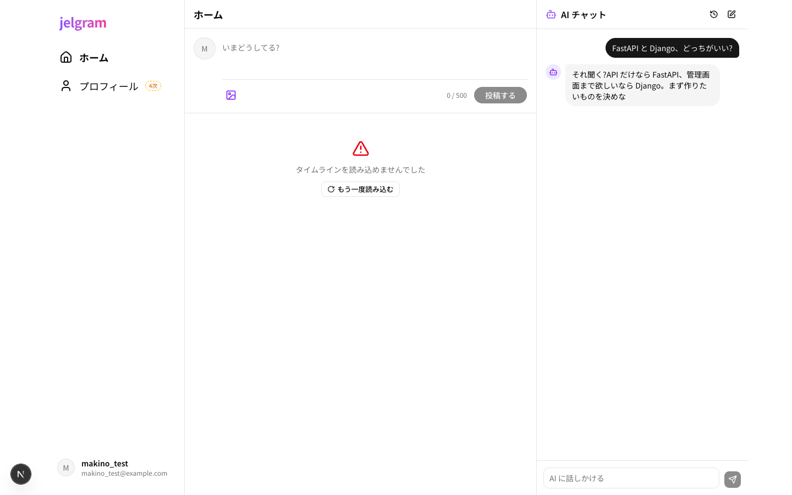

# 02 タイムライン

| 項目     | 内容                           |
| -------- | ------------------------------ |
| URL      | `/`(ホーム)                  |
| フェーズ | 1次                            |
| コード   | `apps/web/app/(main)/page.tsx` |

みんなの投稿を新しい順に並べ、投稿・いいねができる。右には AI チャットが常駐する(04)。

| PC | スマホ |
| --- | --- |
|  |  |

読み込みに失敗したとき:

## 部品と動き

**投稿フォーム**

| 部品              | 動き                                                                     |
| ----------------- | ------------------------------------------------------------------------ |
| 本文の入力欄      | 前後の空白を除いて 1〜500 文字。数えた文字数を右下に出す(超えたら赤)   |
| 画像ボタン        | 画像を 1 枚選ぶ。JPEG・PNG・WebP・GIF、5MB まで(違えばエラーを出す)    |
| 画像のプレビュー  | 選んだ画像を表示。「×」で外せる                                          |
| 「投稿する」      | 本文が空・長すぎるときは押せない。投稿できたら一覧の先頭に足し、フォームを空にする |

**投稿 1 件**

| 部品                   | 動き                                                    |
| ---------------------- | ------------------------------------------------------- |
| アイコン・名前         | その人のユーザーページ(07)へ                          |
| 日時(「3分前」など)  | 投稿詳細(03)へ。本文を押しても同じ                    |
| 画像                   | 大きく表示(05)                                        |
| ハート + 数            | いいね / 取り消し。いいね済みならピンクで塗りつぶし      |
| 「この投稿について」   | AI チャットに、その投稿を指定して質問できる状態にする(04) |
| 「…」(自分の投稿だけ)| 編集・削除のメニュー(06。2次)                         |

**一覧の状態**

| 状態       | 表示                                         |
| ---------- | -------------------------------------------- |
| 読み込み中 | 投稿の形をした灰色の枠(4 件分)             |
| 0 件       | 「まだ投稿がありません」                     |
| 失敗       | メッセージと「もう一度読み込む」ボタン       |

## 使うデータ

| モックの関数                                  | 本物にするとき(予定)                |
| --------------------------------------------- | ------------------------------------- |
| `lib/api/posts.ts` の `getTimeline`           | `GET /posts`                          |
| `lib/api/posts.ts` の `createPost`            | `POST /posts`                         |
| `lib/api/posts.ts` の `likePost`・`unlikePost` | `POST`・`DELETE /posts/{id}/like`    |
| `lib/api/uploads.ts` の `uploadImage`         | `POST /uploads/presign` → Storage へアップロード |

- モックで失敗の表示を見るには、URL に `?mock_error=1` を付ける
