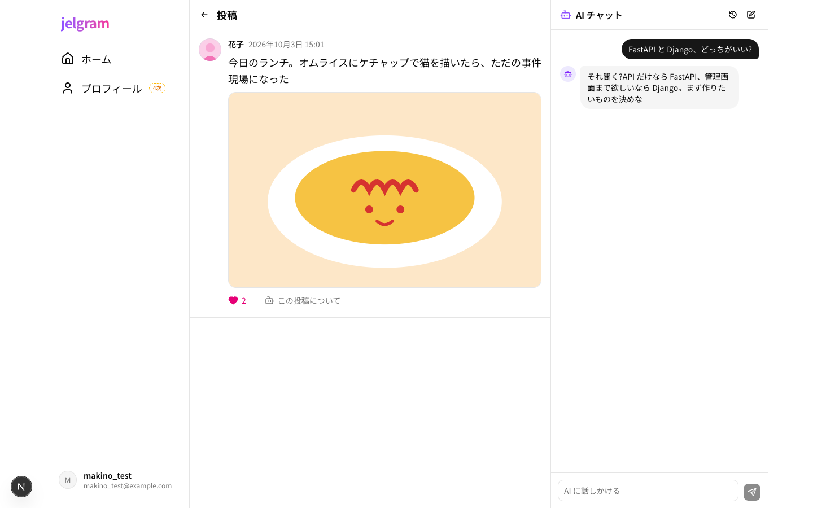
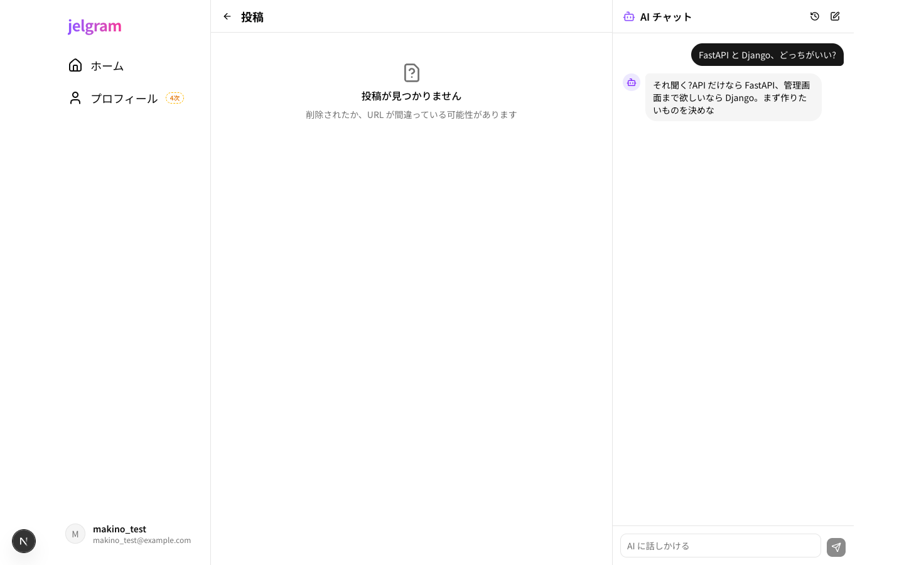

# 03 投稿詳細

| 項目     | 内容                                     |
| -------- | ---------------------------------------- |
| URL      | `/posts/{id}`(例:`/posts/12`)        |
| フェーズ | 1次(要件定義書への追加。新しい API が必要) |
| コード   | `apps/web/app/(main)/posts/[id]/page.tsx` |

投稿 1 件だけを大きく表示する。URL で特定の投稿を開ける(共有できる)。

| PC | スマホ |
| --- | --- |
|  |  |

投稿がないとき:

## 部品と動き

| 部品                 | 動き                                                    |
| -------------------- | ------------------------------------------------------- |
| 「←」               | 前の画面へ戻る(履歴がなければタイムラインへ)          |
| 投稿                 | タイムラインの 1 件と同じ部品。本文は大きめ、日時は「2026年10月3日 15:01」の形 |
| いいね・この投稿について・画像・「…」 | タイムラインと同じ                      |
| (削除したとき)     | タイムラインへ移る                                      |

| 状態         | 表示                                                      |
| ------------ | --------------------------------------------------------- |
| 読み込み中   | 投稿 1 件分の灰色の枠                                     |
| 投稿がない   | 「投稿が見つかりません」(削除済み・URL の間違い)        |
| 失敗         | メッセージと「もう一度読み込む」ボタン                    |

## 使うデータ

| モックの関数                   | 本物にするとき(予定)                       |
| ------------------------------ | -------------------------------------------- |
| `lib/api/posts.ts` の `getPost` | `GET /posts/{id}`(ない投稿は 404)         |
