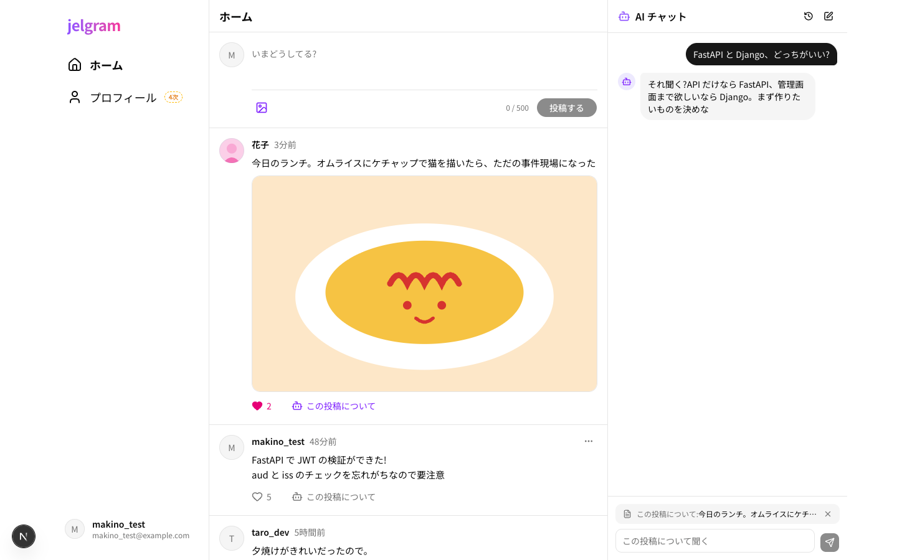
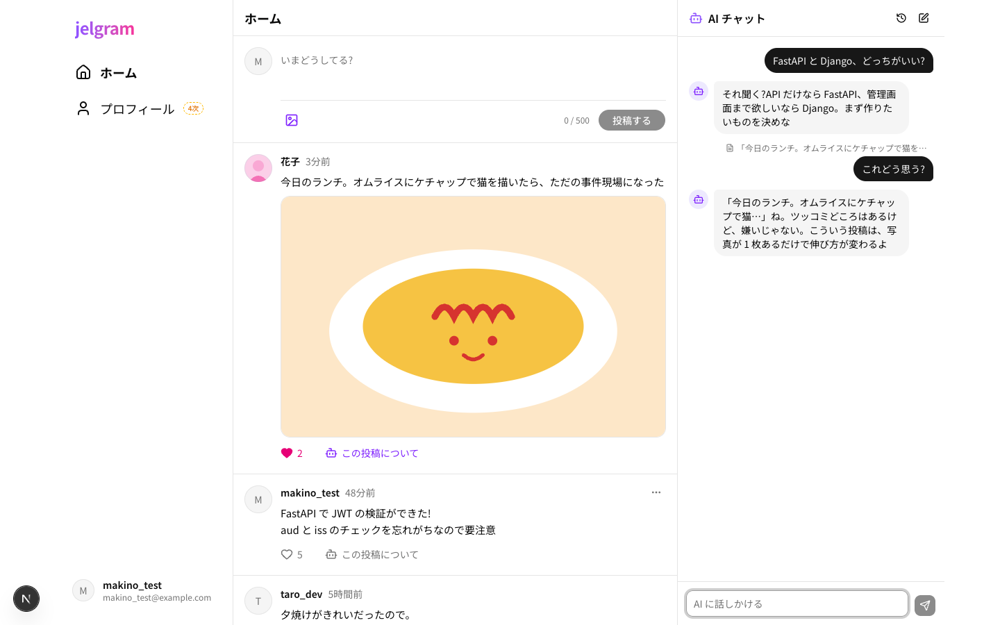
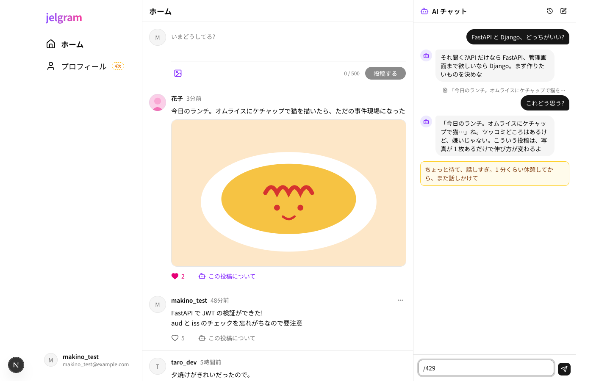
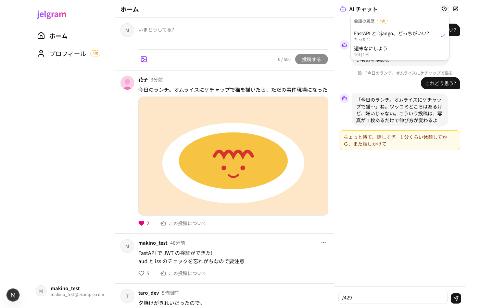
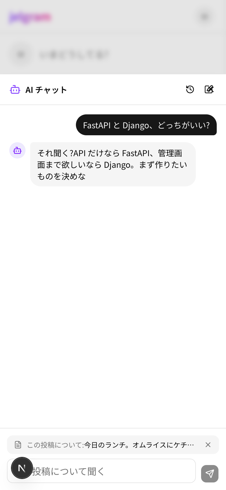

# 04 AI チャット

| 項目     | 内容                                                       |
| -------- | ---------------------------------------------------------- |
| 場所     | ログイン後の全画面。PC は右の列に常駐、スマホは右下のボタンで下から出す |
| フェーズ | 1次(会話の履歴の一覧だけ 5次)                            |
| コード   | `apps/web/components/chat/`                                |

辛口ツッコミ系の AI と話せる(要件定義書 3.3・3.5)。投稿を指定して質問もできる。

| 「この投稿について」を押した | 応答 |
| --- | --- |
|  |  |

| レート制限 | 会話の履歴(5次) | スマホ |
| --- | --- | --- |
|  |  |  |

## 部品と動き

| 部品                         | 動き                                                                 |
| ---------------------------- | -------------------------------------------------------------------- |
| 時計のアイコン(5次)        | 過去の会話の一覧を出す。選ぶとその会話に切り替える                   |
| ペンのアイコン               | 新しい会話を始める(表示を空にする)                                 |
| メッセージの一覧             | 自分は右(黒)、AI は左(灰色)。新しいメッセージが来たら一番下へ   |
| 投稿の指定(入力欄の上)     | 「この投稿について」で選んだ投稿。「×」で外せる。送ると外れる       |
| 入力欄                       | Enter で送信、Shift + Enter で改行(日本語の変換中は送らない)       |
| (送信中)                   | 「考え中…」を出す                                                   |
| (レート制限)               | 黄色の枠で、キャラクターの口調のメッセージを出す。入力した文は戻す   |
| (その他の失敗)             | 上にエラーを出す。入力した文は戻す                                   |
| (会話が空)                 | AI のあいさつ(「で、何の用?…」)を出す                             |

- 会話のセッション id はブラウザに保存し、次に開いたときも同じ会話を続ける

## 使うデータ

| モックの関数                           | 本物にするとき(予定)           |
| -------------------------------------- | ------------------------------- |
| `lib/api/chat.ts` の `sendChatMessage` | `POST /chat`(超えたら 429)    |
| `lib/api/chat.ts` の `getChatHistory`  | `GET /chat/history`             |
| `lib/api/chat.ts` の `getChatSessions` | `GET /chat/sessions`(5次)     |

- モックでレート制限の表示を見るには、`/429` と送る
