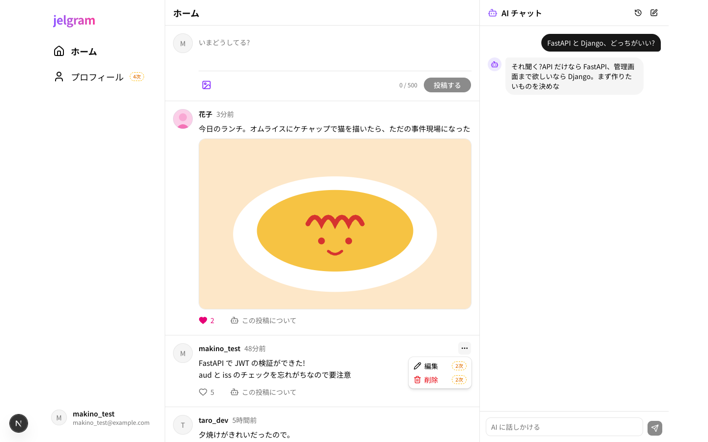
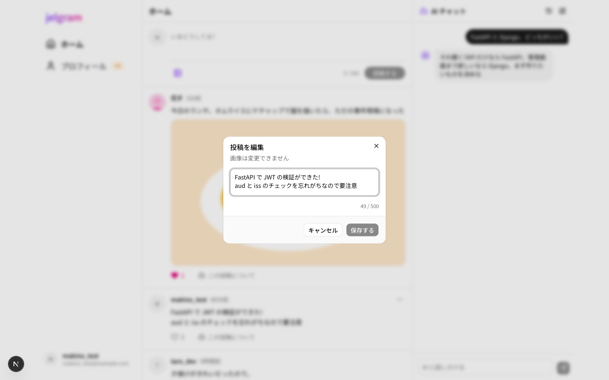
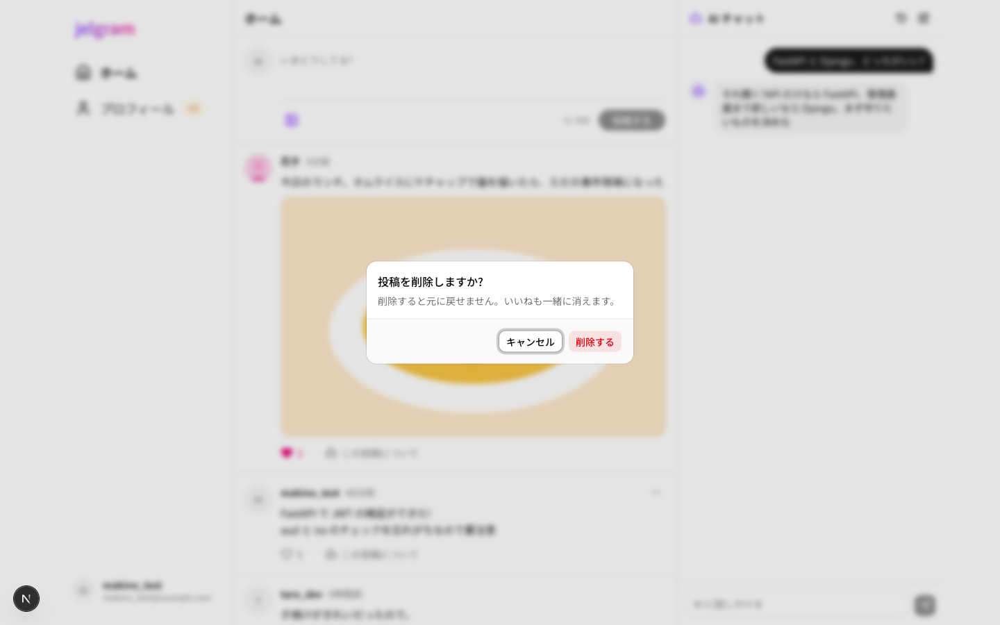

# 06 投稿の編集・削除

| 項目     | 内容                                        |
| -------- | ------------------------------------------- |
| 場所     | 自分の投稿の「…」から、画面の上に重ねて表示 |
| フェーズ | 2次                                         |
| コード   | `apps/web/components/posts/post-menu.tsx`   |

| メニュー | 編集 | 削除の確認 |
| --- | --- | --- |
|  |  |  |

## 部品と動き

| 部品                 | 動き                                                                   |
| -------------------- | ---------------------------------------------------------------------- |
| 「…」               | 自分の投稿にだけ出る。編集・削除のメニューを開く                       |
| 編集(本文の入力欄) | 今の本文が入った状態で開く。1〜500 文字。変えていないときは保存できない。画像は変えられない |
| 「保存する」         | 保存したら、一覧・詳細の表示をその場で変える                           |
| 削除の確認           | 「削除する」で削除。削除が終わるまで閉じない                           |
| (削除したとき)     | 一覧から消える。投稿詳細で削除したらタイムラインへ                     |

## 使うデータ

| モックの関数                      | 本物にするとき(予定)                      |
| --------------------------------- | ------------------------------------------- |
| `lib/api/posts.ts` の `updatePost` | `PATCH /posts/{id}`(自分の投稿以外は 403) |
| `lib/api/posts.ts` の `deletePost` | `DELETE /posts/{id}`(自分の投稿以外は 403)|
