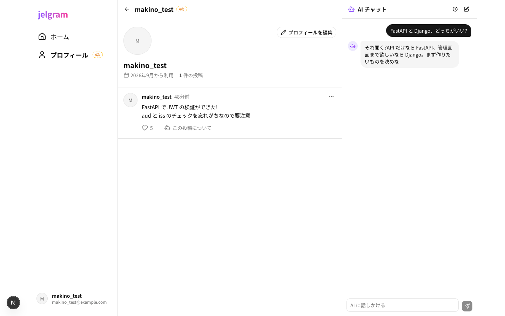
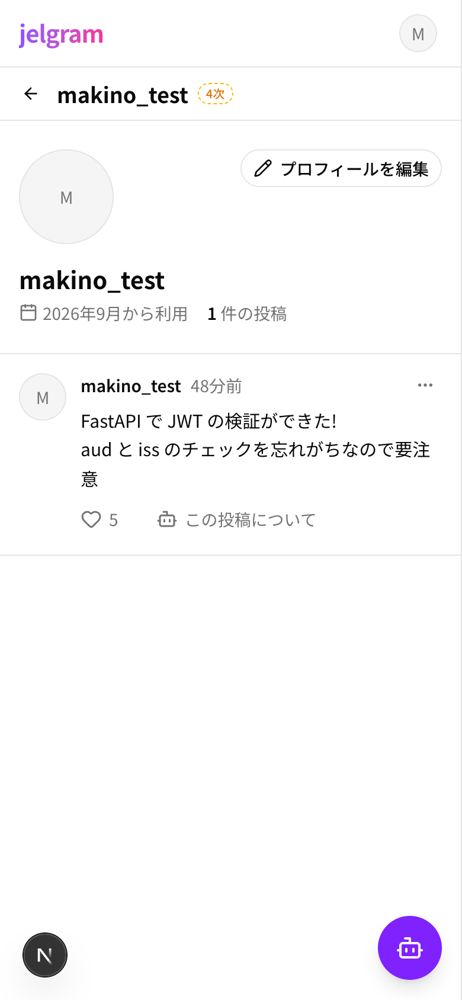

# 07 ユーザーページ

| 項目     | 内容                                      |
| -------- | ----------------------------------------- |
| URL      | `/users/{id}`                             |
| フェーズ | 4次                                       |
| コード   | `apps/web/app/(main)/users/[id]/page.tsx` |

その人のプロフィールと、その人の投稿の一覧を表示する。

| PC | スマホ |
| --- | --- |
|  |  |

## 部品と動き

| 部品                         | 動き                                              |
| ---------------------------- | ------------------------------------------------- |
| アイコン・表示名             | 大きく表示                                        |
| 「〇〇から利用」・投稿の件数 | 参加した年月と、投稿の数                          |
| 「プロフィールを編集」       | 自分のページにだけ出る。プロフィール編集(08)へ   |
| 投稿の一覧                   | その人の投稿だけを新しい順に。部品はタイムラインと同じ |

| 状態           | 表示                                   |
| -------------- | -------------------------------------- |
| 読み込み中     | プロフィールと投稿の灰色の枠           |
| ユーザーがいない | 「ユーザーが見つかりません」         |
| 投稿 0 件      | 「まだ投稿がありません」               |

## 使うデータ

| モックの関数                        | 本物にするとき(予定)       |
| ----------------------------------- | ---------------------------- |
| `lib/api/users.ts` の `getUser`      | `GET /users/{id}`            |
| `lib/api/users.ts` の `getUserPosts` | `GET /users/{id}/posts`      |
