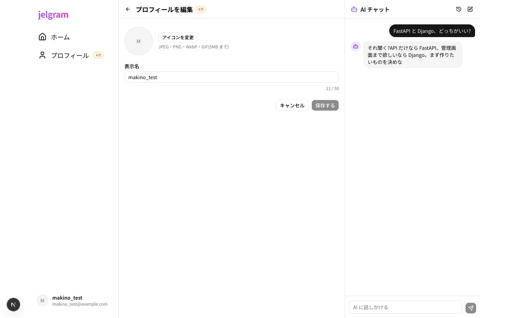
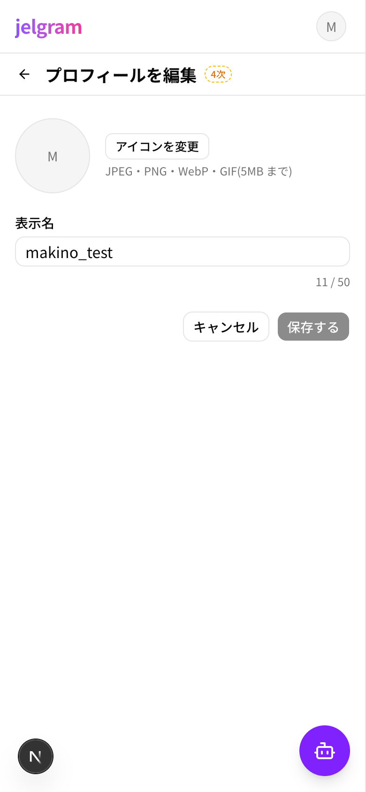

# 08 プロフィール編集

| 項目     | 内容                                            |
| -------- | ----------------------------------------------- |
| URL      | `/settings/profile`                             |
| フェーズ | 4次                                             |
| コード   | `apps/web/app/(main)/settings/profile/page.tsx` |

自分の表示名とアイコンを変える。

| PC | スマホ |
| --- | --- |
|  |  |

## 部品と動き

| 部品               | 動き                                                                   |
| ------------------ | ---------------------------------------------------------------------- |
| アイコン・「アイコンを変更」 | 画像を選ぶ(JPEG・PNG・WebP・GIF、5MB まで)。選ぶとすぐプレビュー |
| 表示名             | 1〜50 文字。空・長すぎるときは赤字で理由を出す                         |
| 「保存する」       | 何も変えていない・入力が正しくないときは押せない。保存したら自分のユーザーページ(07)へ。画面左下などの表示名もすぐ変わる |
| 「キャンセル」・「←」 | 前の画面へ戻る                                                   |

## 使うデータ

| モックの関数                          | 本物にするとき(予定)                        |
| ------------------------------------- | --------------------------------------------- |
| `lib/api/uploads.ts` の `uploadImage`  | `POST /uploads/presign` → Storage へアップロード |
| `lib/api/users.ts` の `updateMyProfile` | `PATCH /me/profile`                         |
