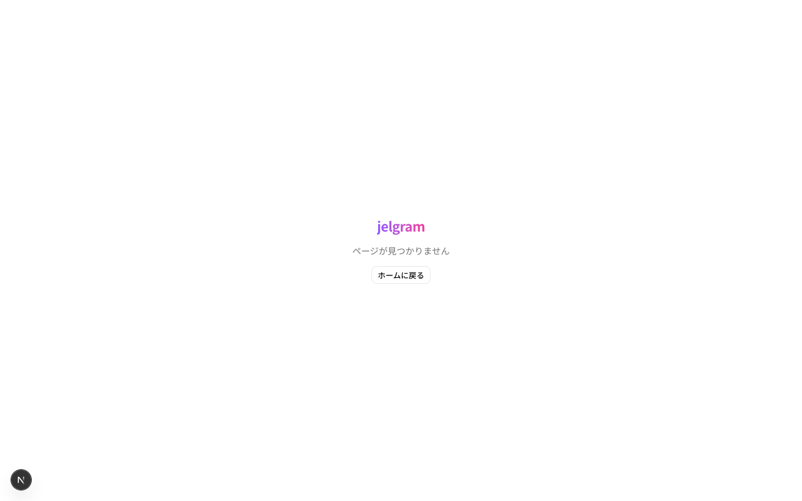
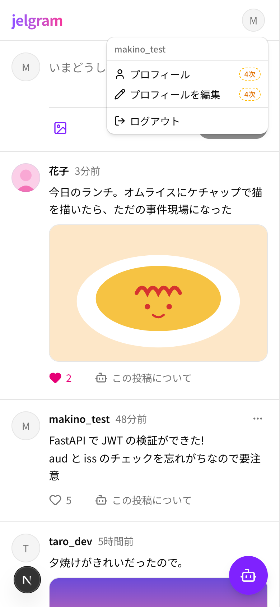

# 09 共通の表示

| 項目     | 内容                                                                 |
| -------- | -------------------------------------------------------------------- |
| フェーズ | 1次                                                                  |
| コード   | `apps/web/app/not-found.tsx`・`app/error.tsx`・`components/common/`・`components/layout/` |

どの画面でも使う表示。

| ページが見つからない | スマホのユーザーメニュー |
| --- | --- |
|  |  |

## 部品と動き

| 部品                       | 動き                                                                  |
| -------------------------- | --------------------------------------------------------------------- |
| ページが見つからない       | ない URL を開いたとき。「ホームに戻る」                               |
| 予期しないエラー           | 画面の表示中にエラーが起きたとき。「もう一度読み込む」                 |
| 上に出るお知らせ(トースト) | 成功(緑)・失敗(赤)を数秒だけ出す。例:「投稿しました」               |
| 読み込み中・0 件・失敗     | 各画面の一覧で同じ見た目を使う(02 の「一覧の状態」)                 |
| ユーザーメニュー           | PC は左下、スマホは右上のアイコン。プロフィール(4次)・プロフィールを編集(4次)・ログアウト |
| フェーズの印(「2次」など) | 1次より後で API につなぐ機能に付ける。点線の黄色い枠                 |
