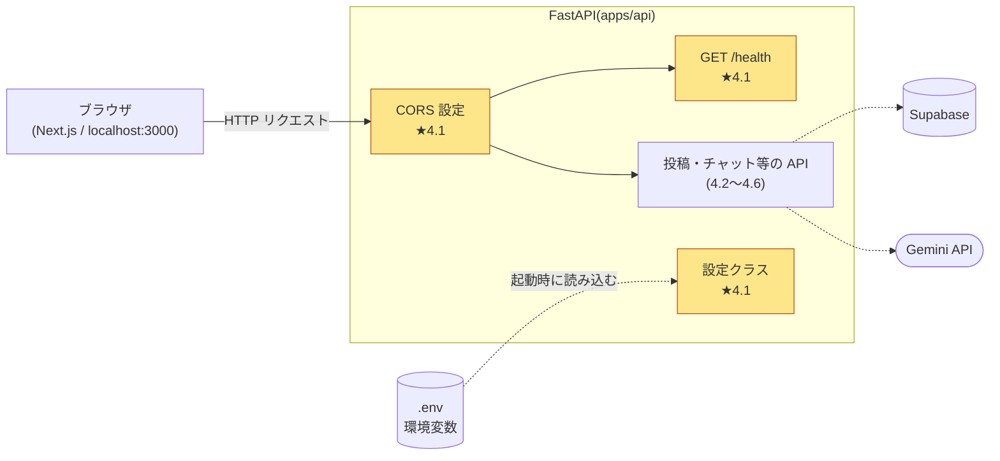
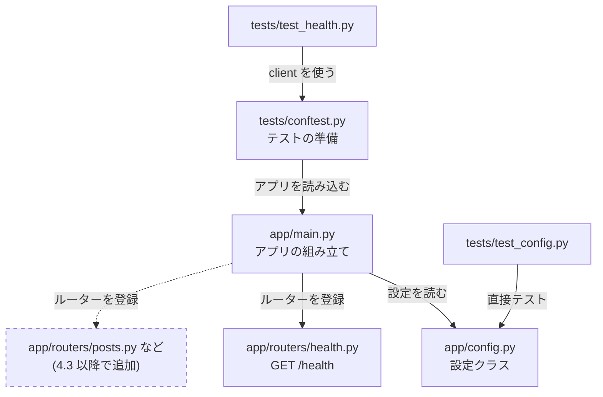
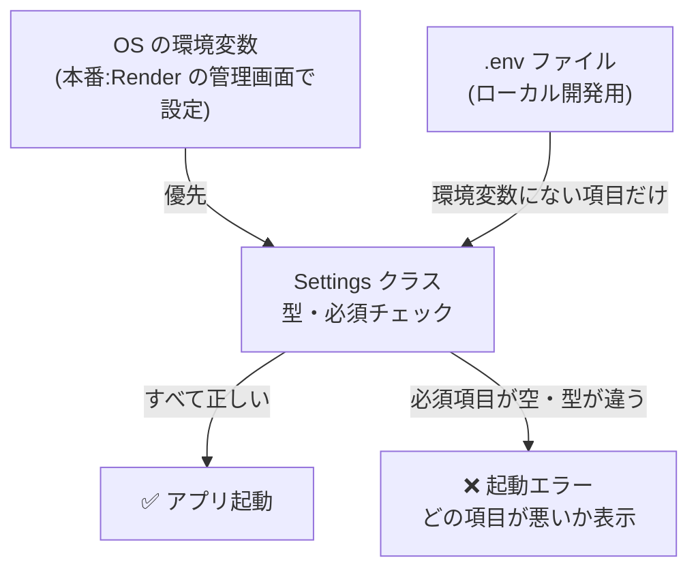
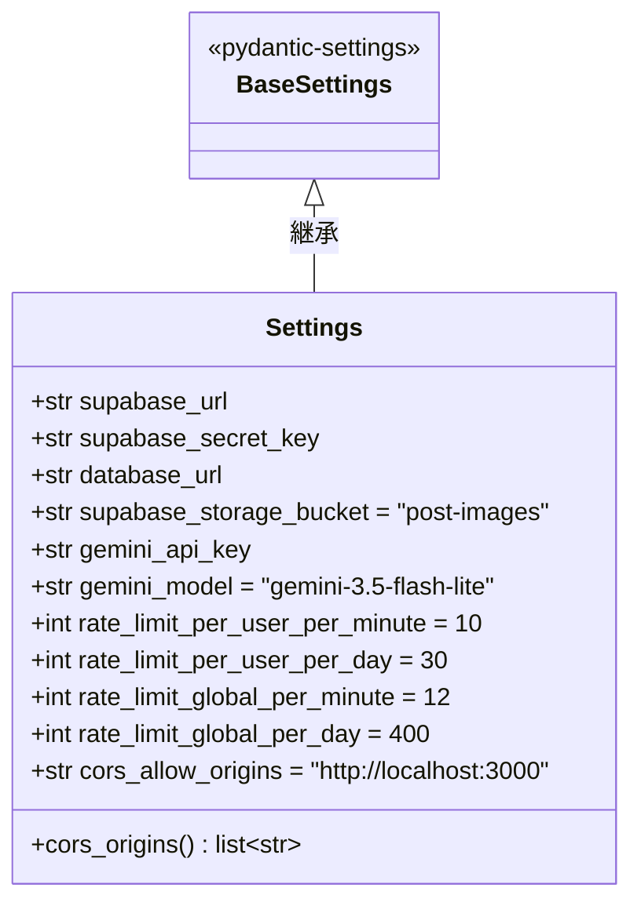
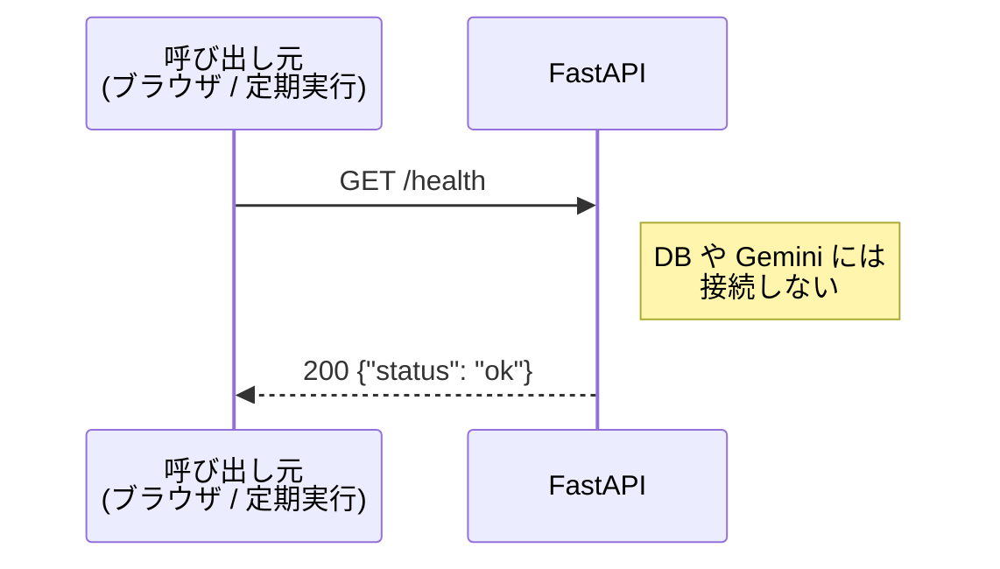
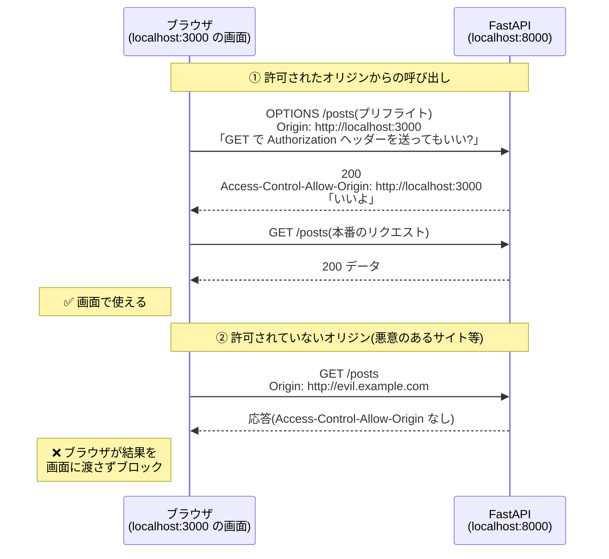
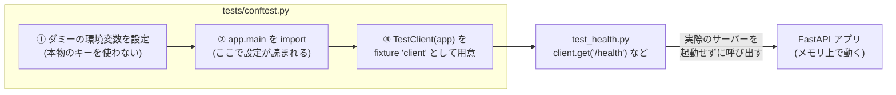

# 詳細設計書:4.1 API ひな形作成(ヘルスチェック・CORS)

| 項目     | 内容                                                   |
| -------- | ------------------------------------------------------ |
| WBS      | 4.1                                                    |
| 対象     | バックエンド(`apps/api`)                             |
| 関連資料 | [要件定義書](../要件定義書.md) 4.1・4.4・5.1・7.1・9章 |

> 📖 **この設計書の読み方**
> 各章の最初にある「💡 なぜ必要?」で、その仕組みがなぜ要るのかを説明している。まずそこを読んで目的をつかんでから、仕様(表や図)を読む。
> 図は Mermaid で書いている。VS Code では Markdown プレビュー(`Cmd + Shift + V`)で図として表示される。

---

## 1. この機能で作るもの

### 💡 なぜ必要?

家を建てるときに、いきなり部屋を作らず、まず基礎と柱を立てるのと同じ。
この後の 4.2〜4.7 では「ログインの確認」「投稿」「AIチャット」など、たくさんの API を作る。そのたびにプロジェクトの作り方や設定の読み方がバラバラだと、後から直すのが大変になる。
そこで最初に、**すべての API が共通で使う土台(ひな形)** を作る。

### 全体の中での位置づけ



★ の付いた黄色の部分が、今回(4.1)作るもの。

| 作るもの     | ひとことで言うと                                                 |
| ------------ | ---------------------------------------------------------------- |
| 設定クラス   | `.env` に書いた接続先やキーを、プログラムから安全に使えるようにする |
| CORS 設定    | ブラウザ(フロントエンド)から API を呼べるように許可を出す       |
| `GET /health` | 「API が生きているか」を確認するための一番シンプルな API         |
| テストの土台 | pytest で API を自動テストできるようにする                        |

### 用語集

| 用語             | 意味                                                                                     |
| ---------------- | ---------------------------------------------------------------------------------------- |
| FastAPI          | Python で API を作るためのフレームワーク                                                 |
| エンドポイント   | API の窓口となる URL とメソッドの組み合わせ(例:`GET /health`)                        |
| ルーター         | エンドポイントを機能ごとにまとめるしくみ(`APIRouter`)                                  |
| ミドルウェア     | すべてのリクエストの前後に共通で処理を挟むしくみ(CORS はこれで実現する)                |
| 環境変数         | プログラムの外から渡す設定値。パスワードなどをコードに直接書かないために使う             |
| オリジン         | `プロトコル + ドメイン + ポート` の組み合わせ(例:`http://localhost:3000`)              |
| fixture          | pytest で、テストの前準備を共通化するしくみ                                              |

## 2. 対象範囲

| 含む                                   | 含まない(後続の WBS で対応)        |
| -------------------------------------- | ------------------------------------- |
| プロジェクト作成・依存パッケージの追加 | JWT 検証(4.2)                       |
| 環境変数を読み込む設定クラス           | DB 接続(4.3 で初めて使うときに作る) |
| CORS 設定                              | 各業務 API(4.3〜4.6)                |
| `GET /health`                          | 本番用の起動設定(7.3)               |
| pytest・Ruff の設定とテスト            |                                       |

## 3. ディレクトリ構成

### 💡 なぜ必要?

1つのファイルに全部書くと、API が増えたときに数千行になって読めなくなる。
**「設定」「API の窓口」「アプリの組み立て」「テスト」を別々のファイルに分ける** ことで、どこに何があるかすぐ分かり、修正の影響範囲も小さくできる。

```
apps/api/
├── .env                 # ローカル用の環境変数(コミットしない)
├── .env.example         # 環境変数のひな形(作成済み)
├── .python-version      # 3.13(作成済み)
├── pyproject.toml       # 依存パッケージ・pytest・Ruff の設定
├── uv.lock              # 依存パッケージのバージョン固定(自動生成・コミットする)
├── app/
│   ├── __init__.py      # 空ファイル
│   ├── main.py          # アプリの組み立て(CORS・ルーターの登録)
│   ├── config.py        # 設定クラス(環境変数の読み込み)
│   └── routers/
│       ├── __init__.py  # 空ファイル
│       └── health.py    # GET /health
└── tests/
    ├── conftest.py      # テスト共通の準備(テスト用の環境変数・TestClient)
    ├── test_health.py   # ヘルスチェック・CORS のテスト
    └── test_config.py   # 設定クラスのテスト
```

### ファイル同士の関係



- `__init__.py` は「このフォルダは Python のパッケージです」という目印。これがあるので `from app.config import get_settings` と書ける
- 新しい API を作るときは、`app/routers/` にファイルを足して `main.py` に登録するだけで済む

## 4. 使用パッケージ

### 💡 なぜ必要?

Python は標準機能だけでも Web サーバーを作れるが、認証・入力チェック・ドキュメント生成などを全部自分で書くのは大変。実績のあるパッケージを組み合わせて、**自分は「アプリ固有の処理」だけを書けばいい状態** にする。

| 種別     | パッケージ          | 用途                                                                                  |
| -------- | ------------------- | ------------------------------------------------------------------------------------- |
| 本体     | `fastapi[standard]` | FastAPI 本体。Uvicorn(サーバー)・httpx(TestClient が使用)・`fastapi` コマンドも含む |
| 本体     | `pydantic-settings` | `.env` と環境変数から設定を読み込み、型チェックする                                   |
| 開発のみ | `pytest`            | テスト                                                                                |
| 開発のみ | `ruff`              | リンター(問題のある書き方を指摘)・フォーマッター(書き方を自動で整える)             |

- 「開発のみ」のパッケージは本番サーバーでは使わない。`uv add --dev` で追加すると区別される
- `uv.lock` にはインストールした**正確なバージョン**が記録される。これをコミットしておくと、別の PC や本番でも同じバージョンが入る

## 5. モジュール設計

### 5.1 `app/config.py`:設定クラス

#### 💡 なぜ必要?

API は Supabase の URL や Gemini のキーなど、**環境(開発・本番)によって変わる値** を使う。これをコードに直接書くと、次の問題が起きる。

- 本番用に切り替えるたびにコードを書き換える必要がある
- キーが GitHub に公開されてしまう

そこで値は `.env`(本番では Render の管理画面)に置き、**設定クラスが1か所でまとめて読み込む**。さらに型や必須チェックをすることで、「キーの入れ忘れ」に **起動した瞬間に気づける** ようにする。気づくのが遅れると、ユーザーがチャットを送った瞬間に初めてエラーになる、という分かりにくい不具合になる。

#### 読み込みの流れ



**読み込みの仕様**

- 環境変数と `apps/api/.env` から読み込む。両方にある場合は環境変数を優先する(pydantic-settings の標準動作)
- 環境変数名は大文字、フィールド名は小文字で対応させる(例:`SUPABASE_URL` → `supabase_url`)
- `.env` に知らない項目があっても無視する(`extra="ignore"`)
- 必須項目が未設定・空文字の場合は、起動時にエラーにする

#### クラス図



**フィールド一覧**

| フィールド                       | 型    | 必須 | 初期値                    | 制約       |
| -------------------------------- | ----- | ---- | ------------------------- | ---------- |
| `supabase_url`                   | `str` | ○    | —                         | 空文字不可 |
| `supabase_secret_key`            | `str` | ○    | —                         | 空文字不可 |
| `database_url`                   | `str` | ○    | —                         | 空文字不可 |
| `supabase_storage_bucket`        | `str` |      | `"post-images"`           |            |
| `gemini_api_key`                 | `str` | ○    | —                         | 空文字不可 |
| `gemini_model`                   | `str` |      | `"gemini-3.5-flash-lite"` |            |
| `rate_limit_per_user_per_minute` | `int` |      | `10`                      | 1 以上     |
| `rate_limit_per_user_per_day`    | `int` |      | `30`                      | 1 以上     |
| `rate_limit_global_per_minute`   | `int` |      | `12`                      | 1 以上     |
| `rate_limit_global_per_day`      | `int` |      | `400`                     | 1 以上     |
| `cors_allow_origins`             | `str` |      | `"http://localhost:3000"` |            |

- 4.1 の時点で使うのは `cors_allow_origins` だけだが、`.env.example` の全項目をここで定義しておく(後で「どこで定義したっけ?」とならないように、設定は1か所に集める)
- 「空文字不可」「1 以上」は、Pydantic の `Field` の制約(`min_length` / `ge`)で表す

> 💡 **ヒント**:`.env` に `GEMINI_API_KEY=` と値が空の行があると、「未設定」ではなく「空文字が設定された」扱いになる。`min_length=1` を付けないと、空のままチェックを通ってしまう。

**プロパティ**

| 名前           | 戻り値      | 仕様                                                                                  |
| -------------- | ----------- | ------------------------------------------------------------------------------------- |
| `cors_origins` | `list[str]` | `cors_allow_origins` をカンマで分割し、前後の空白を除き、空の要素を除いたリストを返す |

例:`"http://localhost:3000, https://example.vercel.app,"` → `["http://localhost:3000", "https://example.vercel.app"]`

> 💡 **なぜ文字列で持ってリストに変換するのか?** 環境変数は必ず「文字列」で渡される。`.env` に書きやすい「カンマ区切りの文字列」で受け取り、使うときにリストに変換するのが一番シンプル。

**関数**

| 名前             | 戻り値     | 仕様                                                                                 |
| ---------------- | ---------- | ------------------------------------------------------------------------------------ |
| `get_settings()` | `Settings` | `Settings` を生成して返す。`functools.lru_cache` で結果を覚えておき、2回目以降は同じものを返す |

> 💡 **なぜキャッシュするのか?** 設定はアプリの実行中に変わらない。呼ばれるたびに `.env` を読み直すのは無駄なので、1回だけ読んで使い回す。

### 5.2 `app/routers/health.py`:ヘルスチェック

#### 💡 なぜ必要?

「API サーバーが起動していて、リクエストに応答できるか」を確かめるための、**一番シンプルな API**。次の用途で使う。

- **開発中**:サーバーがちゃんと起動したかをすぐ確認できる
- **本番**:Render のスリープ対策として、外部から定期的にアクセスする(要件定義書 4.4)
- **Render の監視**:Render が「このサービスは正常か」を判定するのに使える



**仕様**

- `APIRouter` を作り、`GET /health` を定義する(タグ:`health`)
- 応答は Pydantic モデル `HealthResponse` で定義する

| モデル           | フィールド | 型              |
| ---------------- | ---------- | --------------- |
| `HealthResponse` | `status`   | `Literal["ok"]` |

> 💡 **なぜ辞書(`{"status": "ok"}`)をそのまま返さず、モデルを作るのか?** モデルにすると、応答の形が API ドキュメント(`/docs`)に自動で載る。4.7 ではこの情報からフロントエンド用の TypeScript の型を自動生成するので、応答は必ずモデルで定義する、というルールにしておく。

- 認証は不要
- **DB などの外部サービスには接続しない**。スリープ対策で数分おきに呼ばれるため、DB に接続すると負荷と無料枠の消費が増えてしまう

### 5.3 `app/main.py`:アプリ本体

#### 💡 なぜ必要?

`config.py` や `health.py` は「部品」。`main.py` はそれらを**組み立てて1つのアプリにする場所**。起動コマンド(`fastapi dev app/main.py`)はこのファイルを起点に動く。

**処理の流れ**


1. `get_settings()` で設定を取得する
2. `FastAPI` アプリを作成する(`title="jelgram API"`、`version="0.1.0"`)
3. `CORSMiddleware` を追加する(次の 5.4)
4. `health` のルーターを登録する

### 5.4 CORS 設定

#### 💡 なぜ必要?

ブラウザには **「今開いているサイトと違うオリジンの API は、許可がない限り呼ばせない」** という安全のためのルールがある(同一オリジンポリシー)。悪意のあるサイトが、ユーザーのブラウザを使って勝手に別サイトの API を呼ぶのを防ぐためのもの。

jelgram では、画面(`http://localhost:3000`)と API(`http://localhost:8000`)の **ポートが違う = オリジンが違う** ので、何もしないとブラウザが API の呼び出しをブロックする。
そこで API 側から「このオリジンからの呼び出しは許可します」と伝える。これが **CORS**(Cross-Origin Resource Sharing)。

#### ブラウザと API のやり取り



- **プリフライト**:`Authorization` ヘッダーを付けるなど、少し特別なリクエストを送る前に、ブラウザが自動で送る「事前確認」のリクエスト(`OPTIONS`)
- CORS は **ブラウザが守るルール**。curl などブラウザ以外からの呼び出しは止められない。API 自体を守るのは 4.2 の認証の役目

**設定値**

| 設定項目            | 値                              | 理由                                                                  |
| ------------------- | ------------------------------- | --------------------------------------------------------------------- |
| `allow_origins`     | `settings.cors_origins`         | 開発は `http://localhost:3000`、本番は Vercel の URL(環境変数で切替) |
| `allow_methods`     | `GET`, `POST`, `DELETE`         | 9章の API で使うメソッドだけを許可する(必要最小限にする)            |
| `allow_headers`     | `Authorization`, `Content-Type` | JWT(4.2)と JSON の送信に必要なものだけを許可する                    |
| `allow_credentials` | `False`                         | 認証は Cookie ではなく `Authorization` ヘッダーで行うため不要         |

> 💡 **なぜ `allow_origins=["*"]`(全部許可)にしないのか?** 動かすだけなら楽だが、どのサイトからでも API を呼べる状態になる。「必要なものだけ許可する」がセキュリティの基本。

## 6. API 仕様

### `GET /health`

| 項目       | 内容                                              |
| ---------- | ------------------------------------------------- |
| 認証       | 不要                                              |
| リクエスト | なし                                              |
| 正常応答   | `200` `{"status": "ok"}`                          |
| 用途       | 動作確認、スリープ対策の定期実行(要件定義書 4.4) |

## 7. 製造手順

### 全体の流れ


コマンドはすべて `apps/api` で実行する。

**① プロジェクトを作成する**

```
cd apps/api
uv init --bare --name jelgram-api
```

- `--bare` を付けると `pyproject.toml` だけが作られる(サンプルの `main.py` などは作られない)

**② パッケージを追加する**

```
uv add "fastapi[standard]" pydantic-settings
uv add --dev pytest ruff
```

- `.venv`(仮想環境)と `uv.lock` が自動で作られる

**③ `pyproject.toml` に pytest と Ruff の設定を追記する**

```toml
[tool.pytest.ini_options]
pythonpath = ["."]
testpaths = ["tests"]

[tool.ruff]
line-length = 100

[tool.ruff.lint]
select = ["E", "F", "I", "UP", "B"]
```

| 設定                         | 意味                                                                   |
| ---------------------------- | ---------------------------------------------------------------------- |
| `pythonpath = ["."]`         | テストから `import app...` できるようにする                            |
| `testpaths = ["tests"]`      | `tests/` の中だけをテストとして探す                                    |
| `line-length = 100`          | 1行の最大文字数                                                        |
| `select = [...]`             | E/F:基本的な誤り、I:import の並び順、UP:新しい書き方への置き換え、B:バグになりやすい書き方 |

**④〜⑥ 3章の構成でファイルを作り、5章の設計どおりに実装する**

- 部品 → 組み立ての順(`config.py` → `health.py` → `main.py`)で作ると、途中で動作確認しやすい

**⑦ 起動して動作確認する**

```
uv run fastapi dev app/main.py
```

- `http://localhost:8000` で起動する。コードを保存すると自動で再起動する

**参考(公式ドキュメント)**

- [Settings and Environment Variables](https://fastapi.tiangolo.com/advanced/settings/)
- [CORS](https://fastapi.tiangolo.com/tutorial/cors/)
- [Bigger Applications(APIRouter)](https://fastapi.tiangolo.com/tutorial/bigger-applications/)
- [Testing](https://fastapi.tiangolo.com/tutorial/testing/)

## 8. テスト仕様(pytest)

### 💡 なぜ必要?

打鍵(手で動かして確認)だけだと、**後で別の機能を作ったときに、前に作った機能が壊れていないか** を毎回すべて手で確かめ直す必要がある。
自動テストを書いておけば、`uv run pytest` の1コマンドで何度でも数秒で確認できる。機能が増えるほど効果が大きくなる。

### 8.1 テストの仕組み



- **TestClient**:サーバーを起動しなくても、プログラムの中から API を呼び出せる道具。速くて、ポートの競合も起きない
- テストがローカルの `.env`(本物のキー)に依存しないよう、**ダミー値を環境変数に設定してから** `app.main` を読み込む。環境変数は `.env` より優先されるので、ダミー値が使われる
  - 設定する項目:`SUPABASE_URL`・`SUPABASE_SECRET_KEY`・`DATABASE_URL`・`GEMINI_API_KEY`(必須項目)と `CORS_ALLOW_ORIGINS=http://localhost:3000`

> 💡 **ヒント**:`app.main` は読み込まれた瞬間に設定を読むため、環境変数の設定は `import` より**前**に書く必要がある。

### 8.2 テストケース

| No.  | ファイル         | テスト内容                                      | 条件・入力                                                                                    | 期待結果                                                                          |
| ---- | ---------------- | ----------------------------------------------- | --------------------------------------------------------------------------------------------- | --------------------------------------------------------------------------------- |
| T-01 | `test_health.py` | ヘルスチェックが正常に応答する                  | `GET /health`(認証ヘッダーなし)                                                            | `200`、`{"status": "ok"}`                                                         |
| T-02 | `test_health.py` | 許可したオリジンからのプリフライトが通る        | `OPTIONS /health`、`Origin: http://localhost:3000`、`Access-Control-Request-Method: GET`     | `200`、`access-control-allow-origin` が `http://localhost:3000`                   |
| T-03 | `test_health.py` | 許可していないオリジンには CORS 許可を返さない  | `GET /health`、`Origin: http://evil.example.com`                                              | 応答に `access-control-allow-origin` ヘッダーが含まれない                         |
| T-04 | `test_config.py` | CORS オリジンのカンマ区切りを分割できる         | `cors_allow_origins="http://a.com, http://b.com,"`                                            | `cors_origins` が `["http://a.com", "http://b.com"]`                              |
| T-05 | `test_config.py` | 必須項目が空文字だとエラーになる                | `gemini_api_key=""`(他の必須項目は値あり)                                                  | `pydantic.ValidationError` が発生する                                             |
| T-06 | `test_config.py` | 省略した項目に初期値が入る                      | 必須項目のみ指定                                                                              | `gemini_model` が `"gemini-3.5-flash-lite"`、`rate_limit_global_per_day` が `400` |
| T-07 | `test_config.py` | レート制限に 0 以下を指定するとエラーになる     | `rate_limit_per_user_per_minute=0`                                                            | `pydantic.ValidationError` が発生する                                             |

> 💡 **ヒント**:`test_config.py` で `Settings(...)` を直接作るときは、`_env_file=None` を渡すとローカルの `.env` を読まずにテストできる。

> 💡 **テストケースの考え方**:「正しく動くこと(T-01, T-02, T-04, T-06)」だけでなく、「ダメなものをちゃんと拒否すること(T-03, T-05, T-07)」もテストする。不具合は拒否すべきものを通してしまうところで起きやすい。

### 8.3 実行方法と合格基準

```
uv run pytest -v
uv run ruff check .
uv run ruff format --check .
```

- pytest:全テストが成功すること
- Ruff:指摘が 0 件であること(`uv run ruff format .` で自動整形できる)

## 9. 打鍵テスト

### 💡 なぜ必要?

自動テストは「決めた条件」しか確認しない。実際に起動して、**人の目で使ってみて初めて気づくこと**(起動時のログが分かりにくい、ドキュメント画面の表示がおかしい等)を確認する。

`uv run fastapi dev app/main.py` で起動した状態で行う。

| No.  | 確認内容                     | 手順                                                                                             | 期待結果                                                                                         | 結果 |
| ---- | ---------------------------- | ------------------------------------------------------------------------------------------------ | ------------------------------------------------------------------------------------------------ | ---- |
| K-01 | 起動できる                   | 上記コマンドを実行する                                                                           | エラーなく起動し、`http://127.0.0.1:8000` で待ち受けるログが出る                                 | ⬜   |
| K-02 | ヘルスチェック               | ブラウザで `http://localhost:8000/health` を開く                                                 | `{"status":"ok"}` が表示される                                                                   | ⬜   |
| K-03 | API ドキュメント画面         | ブラウザで `http://localhost:8000/docs` を開き、`GET /health` の **Try it out → Execute** を押す | 画面が表示され、`200` と `{"status": "ok"}` が返る                                               | ⬜   |
| K-04 | 自動再起動                   | 起動したまま `health.py` を保存し直す                                                            | ログに再起動が表示され、K-02 が引き続き成功する                                                  | ⬜   |
| K-05 | 設定漏れを起動時に検出できる | `.env` の `GEMINI_API_KEY` の値を一時的に消して起動する                                          | 起動時にエラーになり、`gemini_api_key` が原因と分かるメッセージが出る。**確認後は値を元に戻す** | ⬜   |

## 10. 完了条件

- 8章のテストがすべて成功し、Ruff の指摘が 0 件
- 9章の打鍵テストがすべて OK
- 変更を GitHub に push 済み(`.env` が含まれていないことを確認する)

## 改訂履歴

| 日付       | 内容                                         |
| ---------- | -------------------------------------------- |
| 2026-09-28 | 初版作成                                     |
| 2026-09-28 | 図(Mermaid)と「なぜ必要?」の解説を追加     |
